# Tahak infomercial kit

Everything to cut the Tahak showcase video (the AppBuildersPH demo is due **10:00 AM, Oct 10**) and its social versions.

**New: `08-v2-hype/`** is the high-energy, no-dead-air version with a finished soundtrack. Start with `08-v2-hype/EDIT-v2.md`.

Open `storyboard.html` for the calm v1 cut at a glance.

| Folder | What's in it |
|---|---|
| `01-script/` | `SCRIPT.md` (60 s, 30 s and 15 s cuts, which claims are safe), `voiceover-60s.txt`, `captions-60s.srt`, `shot-list.csv` |
| `02-screenshots/raw-flip6/` | 8 real captures from the Flip 6, 1080 × 2640, night theme, airplane mode |
| `02-screenshots/promo-cards-9x16/` | 6 cards for Reels, TikTok and Stories (1080 × 1920) |
| `02-screenshots/promo-cards-16x9/` | The same 6 cards for the video and slides (1920 × 1080) |
| `03-graphics/title-end-cards/` | Title and end cards in 16:9 and 9:16, plus a day-theme title |
| `03-graphics/overlays/` | Transparent badges: airplane mode, real speed, simulated walk, AI on the phone, and the Deviation lower third |
| `04-brand/` | Wordmarks, a square mark, palette, Barlow fonts, `BRAND.md` |
| `05-audio-sfx/` | The app's real Deviation tone and Flare whistle |
| `06-capture/` | `CAPTURE.md` (phone prep, scrcpy, deep links, shots still needed) and `capture.sh` |
| `07-voiceover/` | Two ElevenLabs takes of the main 60 s voice-over (Kuya J, Filipino-accented English) and `NOTES.md` |
| `08-v2-hype/` | **v2:** the finished 66 s soundtrack (hype voice + extreme music + SFX, no gaps), stems, word-timed captions, and a cut list with exact timecodes |
| `tools/build_kit.py` | Rebuilds the cards from the raw captures |

## What's ready and what isn't

**Ready:** title and end cards, all overlays, and stills of the Destination Pack, its reference notes, the Hike map before and during a Hike, the Guides library and the Flare screen.

**Still to film** (details in `06-capture/CAPTURE.md`):
- the airplane-mode swipe;
- the Deviation alert, which needs sound and vibration;
- the Flare firing, filmed live with a camera;
- the Assistant answer and Emergency Guide card, which aren't on `main` yet. `SCRIPT.md` has a fallback cut without them.

## Screenshots

Real captures from the Galaxy Z Flip 6, in airplane mode and the night theme, from `02-screenshots/raw-flip6/`.

| Hike map, during a Hike | Hike map, choosing a Trail | Simulated walk, drifting |
|---|---|---|
| 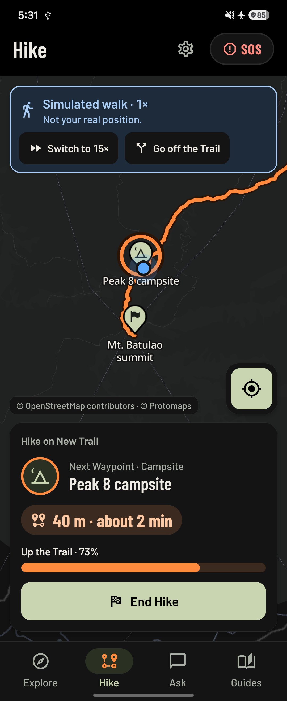 | 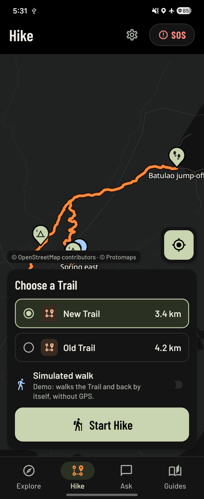 | 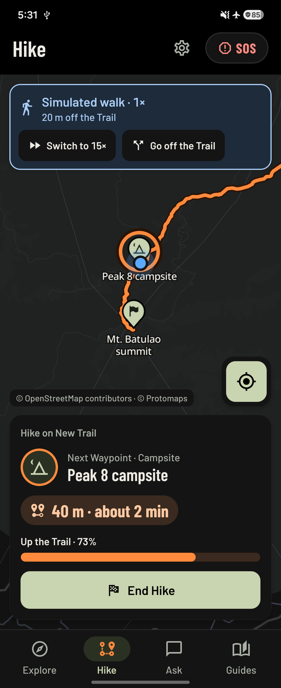 |
| **Mt. Batulao Destination Pack** | **Waypoints by Trail** | **Trail notes with sources** |
| 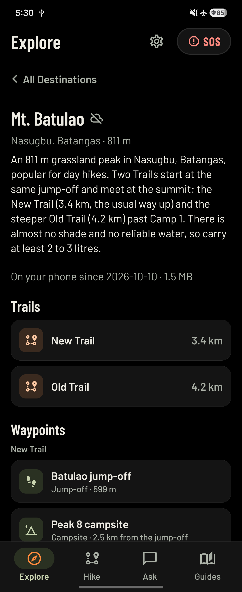 | 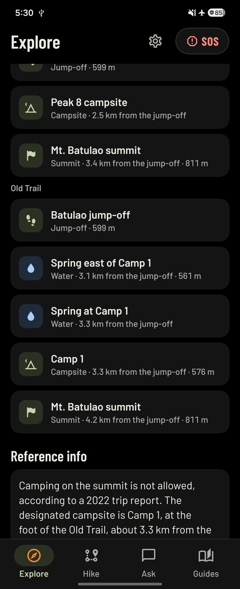 | 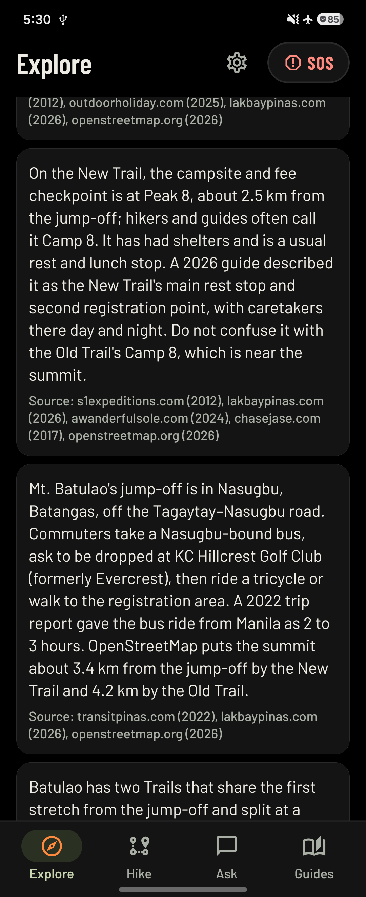 |
| **Guides library** | **Flare** | |
| 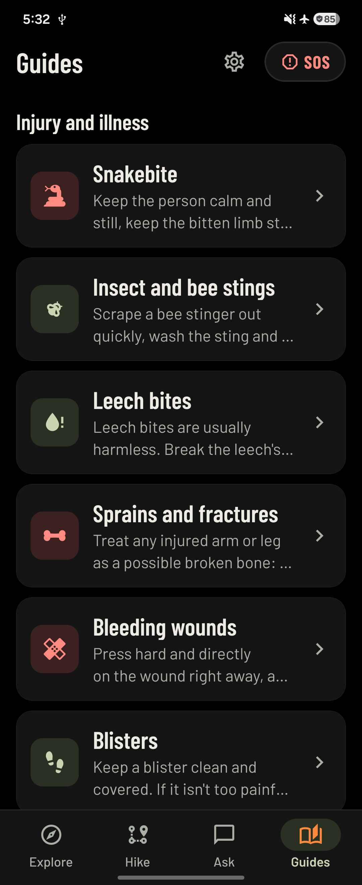 | 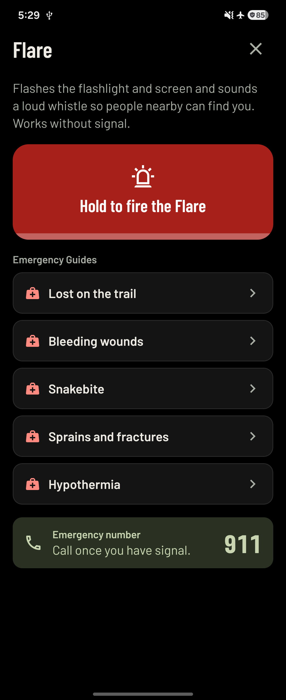 | |

### Promo cards (16:9)

| | |
|---|---|
| 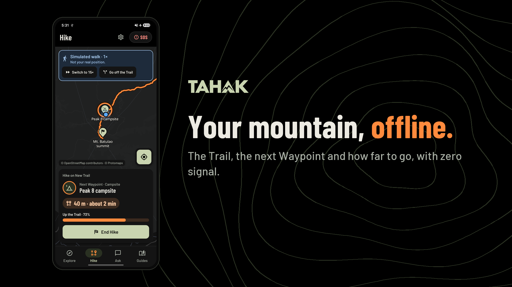 | 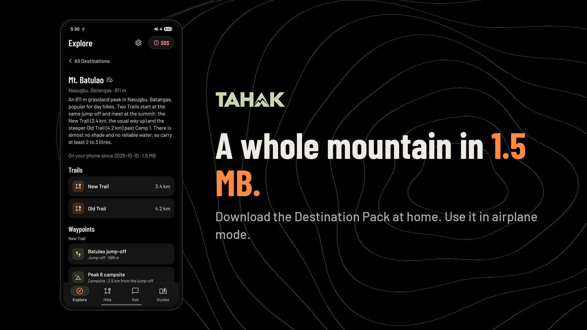 |
| 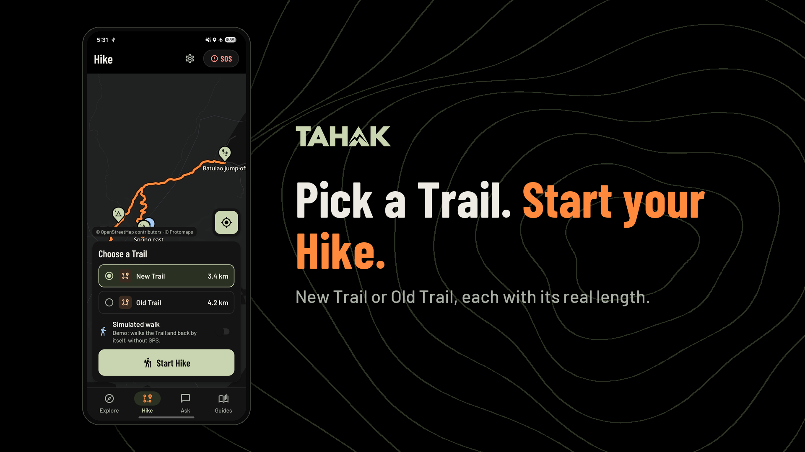 | 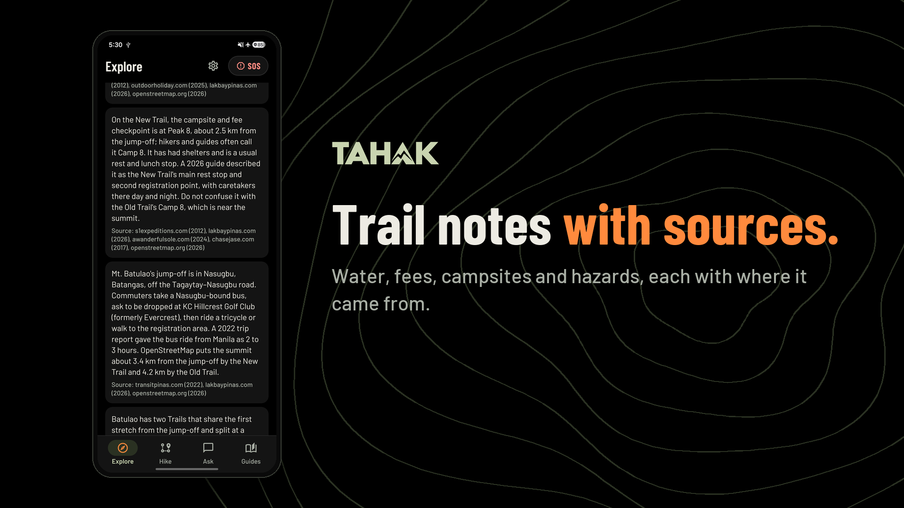 |
| 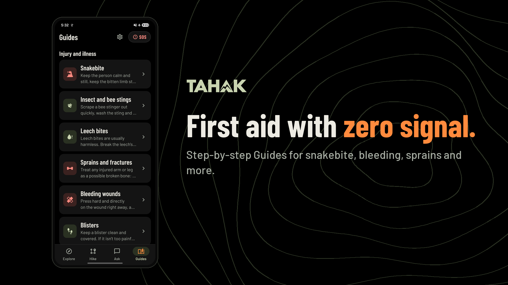 | 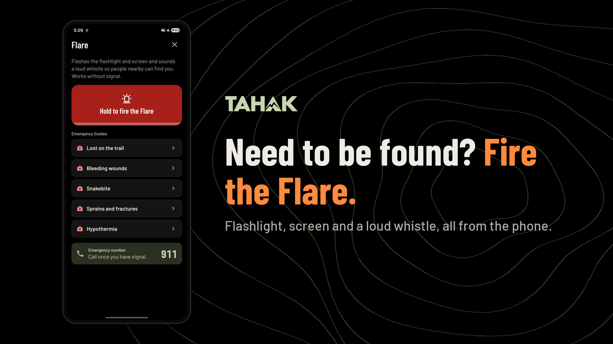 |

The 9:16 versions are in `02-screenshots/promo-cards-9x16/`.

### Title and end cards

| Title | End |
|---|---|
| 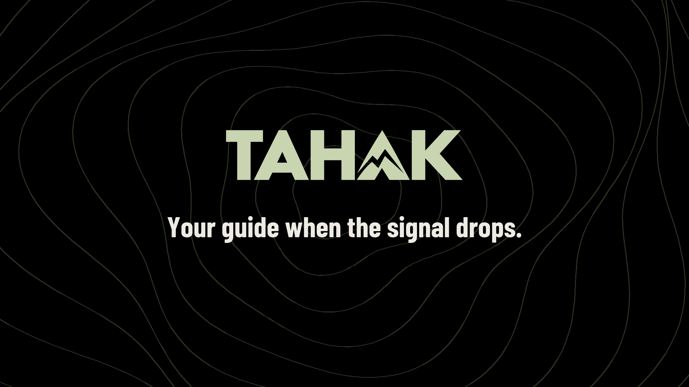 | 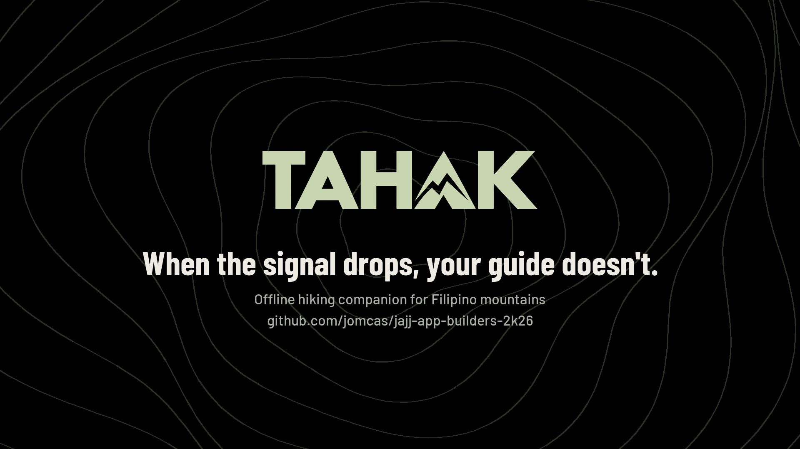 |

## Three things to watch

1. **No fake speed.** Show Assistant answers at real speed, or label any cut with `badge-real-speed.png`. The rules disqualify fake benchmarks.
2. **Label the simulated walk.** Keep the app's "Simulated walk" banner visible and add `badge-simulated-walk.png`.
3. **Don't show the app icon.** It's still Expo's default placeholder. Use `04-brand/logo/tahak-mark-night_1024.png` instead.

## Rebuilding the cards

After adding or replacing a capture, edit the `CARDS` list in `tools/build_kit.py` (capture, headline, accent words, subline), then run:

```bash
python3 tools/build_kit.py 02-screenshots/raw-flip6 .
```

It needs Pillow and the repo checked out at `~/Personal/jajj-app-builders-2k26` for the fonts and logos.
